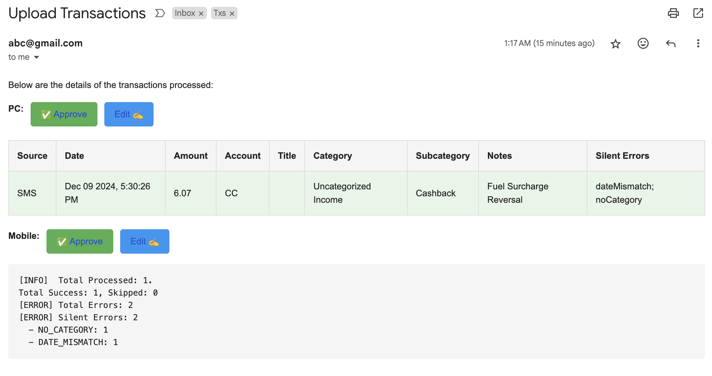

# Mail2Cashew-TPS (Transaction Processing Service)
This GScript parses Transaction emails and creates Cashew app links. Users can open those links to add transactions to Cashew app.

- [Mail2Cashew-TPS (Transaction Processing Service)](#mail2cashew-tps-transaction-processing-service)
- [Mail2Cashew Transaction Processing Service](#mail2cashew-transaction-processing-service)
  - [Introduction](#introduction)
  - [Features](#features)
  - [Happy Case Usage](#happy-case-usage)
  - [Setup](#setup)
    - [One-Time Setup for Emails](#one-time-setup-for-emails)
    - [Setup for SMS](#setup-for-sms)
  - [Deployment](#deployment)
    - [Deploying the Script](#deploying-the-script)
  - [Usage](#usage)
    - [Running the Script](#running-the-script)
  - [Rough Code Flow](#rough-code-flow)
  - [Testing and Development](#testing-and-development)
    - [Sanity Tests](#sanity-tests)
    - [Configurable Flags](#configurable-flags)
  - [Up Next](#up-next)
  - [Appendix](#appendix)


# Mail2Cashew Transaction Processing Service
This project is a Google Apps Script (GAS) designed to process transactional emails and SMS messages, extract essential financial data, and store the details in a Google Sheet for further analysis. The script is highly configurable, supports automated email labeling, and integrates error reporting. Additionally, it generates links for the Cashew app, enabling users to directly add transactions to their accounts.

---

## Introduction
This script automates the process of managing financial transactions received via email or SMS. Here’s how it works:

1. **Email or SMS is received**.
2. **The script runs** either at a scheduled time or when triggered manually via a link.
3. **Transaction processing** begins, extracting details based on predefined rules.
4. **Success Email**: A summary email is sent with a table of all transactions processed since the last run. Links are provided for:
   - Directly adding transactions to Cashew.
   - Editing transactions for both PC and mobile apps.
   - 
5. **Identify Duplicate Transactions**: Any transaction for which exact matching details are already present in sheet are skipped by default:
   - Duplicate transactions are not included in any URL (Edit/Approve). 
   - If required then enter manually OR use single Transaction URL added to sheet.
   - Color coded by Red background.
   - 
6. **Silent Errors**: Any fallback values used due to missing data are mentioned in the success email.
   - 
7. **Stopping Errors**: Failed emails trigger error notifications.
   - 
8. **Data Storage**: All processed information is stored in a Google Sheet for future analysis and rerunning failed queries.
   - Sample SpeadSheet [Link](./resources/Copy%20of%20Sample%20Sheet.xlsx)
   - 

---

## Features
- **Automated Email Processing**: Fetch unread or specific emails based on configurable filters.
- **Regex-Based Parsing**: Extracts key details such as date, account, amount, type, and category using regex rules.
- **Google Sheets Integration**: Stores transaction details in a specified Google Sheet.
- **Configurable Behavior**: Allows reprocessing of emails, skipping duplicates, or processing test cases.
- **Error Handling**: Logs errors and optionally sends email notifications for silent or stopping errors.
- **Email Labeling**: Marks emails as processed and applies labels for better organization.
- **Sanity Testing**: Provides test modes for validating regex rules and configurations.
- **Cashew Integration**: Generates links for users to directly add transactions to the Cashew app.

---

## Happy Case Usage
1. Fetch emails that match specific labels or queries.
2. Process each email:
   - Extract transaction details (date, account, amount, type, category, etc.).
   - Validate mandatory fields and handle errors if necessary.
3. Append data to a Google Sheet.
4. Send a success email with a table of transactions and links for direct addition or editing.
5. Mark emails as processed (labeled and marked as read).

---

## Setup
### One-Time Setup for Emails
1. **Create a Google Apps Script Project**:
   - Visit [Google Apps Script](https://script.google.com/home/) and create a new project.

2. **Add Files**:
   - Upload the script files in the following order:
     1. `constants`
     2. `userConfig`
     3. `main`
     4. `utils`
     5. `test`
   - Files are evaluated in order, so this sequence is essential. Alternatives are provided in the appendix.
   - The files in GScipt are of .gs extension. But we can rename to .js and work on local.

3. **Add Moment.js Library**:
   - Follow [this guide](https://stackoverflow.com/a/75672093) to add Moment.js.

4. **Enable Gmail API**:
   - Configure the Gmail API as per [Google’s documentation](https://developers.google.com/gmail/api/quickstart/apps-script#configure_the_script).

5. **Update Credentials**:
   - Use `storeSecrets` to save sensitive data securely:
     - **Email Address**: Used for notifications.
     - **Spreadsheet ID**: Google Sheet ID where transaction data will be stored.
     - **Account Identifiers**: Keywords for sensitive accounts (e.g., bank account or credit card identifiers).
     Example:
     ```javascript
     const mySecrets = {
         EMAIL: "user1@example.com",
         SPREADSHEET_ID: "1234",
         ACCOUNT_ID_ACCOUNT_SAVINGS: ["XXXX1234", "additional identifier"],
     };
     storeSecrets(mySecrets);
     ```
   - Delete credentials from `userConfig` after saving them.

6. **Prepare Spreadsheet**:
   - Import or create a Google Sheet for storing transactions, and set its ID in `mySecrets.SPREADSHEET_ID`. Sample SpeadSheet [Link](./resources/Copy%20of%20Sample%20Sheet.xlsx)


7. **Configure Regex Rules**:
   - Define regex patterns to extract transaction details from email content. For eg. for following content - 
   - `// Your ABC Bank Credit Card XX1234 has been used for a transaction of INR 363.00 on Dec 06, 2024 at 01:18:50. Info: ABC SERVICE. The Available Credit Limit`

     - **Date and Time**: Extracts formatted date and time (e.g., "Dec 06, 2024" at "01:18:50").
     - **Account Identifiers**: Extracts account (e.g., "Credit Card XX1234").
     - **Transaction Amount**: Extracts monetary values (e.g., "INR 363.00").
     - **Merchant Info**: Extracts merchant or vendor details (e.g., "ABC SERVICE").
     Example:
     ```javascript

     const regexMap = {
        "CC-Debit": {
            dateRegex: /\b([A-Za-z]{3}\s\d{2},\s\d{4})\s*at\s(\d{2}:\d{2}:\d{2})\b/, // Extracts date "Dec 06, 2024" and time "01:18:50".
            fromAccountRegex: /Credit Card\s([A-Za-z0-9]+)\s/, // Extracts account identifier "XX1234" from "Credit Card XX1234".
            amountRegex: /transaction of\s[A-Za-z]+\s([\d,]+\.\d{2})/, // Extracts amount "363.00" from "transaction of INR 363.00".
            merchantRegex: /Info:\s*(.+?)\. The Available Credit Limit/ // Extracts merchant info "ABC SERVICE".
        },
     };
     ```
   - Configure categories and subcategories to classify expenses or income:
     - Example for keywords and subcategories:
       ```javascript
        const categorySubcategoryKeywordMap = deepFreeze({
            expenses: {
                "Transit": {
                    keywords: ["fuel", "travel", "commute"], // Matches "Transit" category for these keywords.
                    subcategories: {
                        "CNG": ["STATION 1", "Gas Station"], // Matches "CNG" subcategory for these keywords.
                        "Public Transport": ["bus", "metro", "train"],
                    },
                },
                "Food": {
                    subcategories: {
                        "Restaurants": ["restaurant", "dining", "cafe"],
                        "Groceries": ["grocery", "supermarket", "vegetables", "fruits"],
                    },
                },
                "Uncategorized Expense": {
                    keywords: [USER_CONSTANTS.EXPENSE_CATEGORY], // Fallback category if no match is found.
                },
            },
        });
       ```
    - Define subcategory-specific keywords:
       ```javascript
          const subcategoryKeywordMap = deepFreeze({
             "SubCategory1": ["Sub category identifier"], // Matches "SubCategory1" for specific identifiers.
          });
      ```

8. **Optional Gmail Labels**: - OPTIONALLY create following labels in GMAIL and create filters to tag different emails based on following rules.

```javascript
    const LABELS = {
        EMAIL: 'Txs/💳',        // Tag All emails related to transactions from banks.
        SINGLE_SMS: 'Txs/💬',   // Tag emails which contain SMS sent using automate as soon as it is received.
        BACKUP_SMS: 'Txs/🛜',   // Tag emails which contain SMS received offline and mailed later.
        TESTCASES: 'Txs/🧪',    // Tag emails for running in sanity tests usecase.
        IGNORED: 'Txs/❌',      // Tag emails which are not valid transaction emails. Can be used on top of above filters to skip specific emails.
        PROCESSED: 'Txs/✅',    // Tag emails which have been processed by Script successfully.
        TO_FIX: 'Txs/🛠️',       // Tag emails that need Regex update before it's success. These will be excluded unless regex is fixed in code.
    };
```

### Setup for SMS
1. **Install Automate App**:
   - Download from [Google Play Store](https://play.google.com/store/apps/details?id=com.llamalab.automate&hl=en_IN).

2. **Create Flow**:
   - Create a simple flow which listens for messages, matches them against a basic regex pattern for filtering (eg. include keywords like credit, debit, transfer & exclude keywords like OTP, declined etc)
   - Recommended flow for starting point. Download and import in Automate. [Link](./resources/Forward%20SMS%20containing%20keyword%20to%20Email%20(Gmail)%20[contents%20regex%20&%20backup%20file].flo)
   - Need to authenticate Google Drive separately. `Create a flow with a single Google Drive block, click the Google account field in it, select an account to authorize it.`
   - TODO: Upload advanced flow in next commit.
   <!-- - Use the provided flow link to configure SMS forwarding. -->
   <!-- - Update regex patterns in the flow for filtering relevant SMS. -->

3. **Run and Test Flow**:
   - Use test modes to validate the flow's behavior.

---

## Deployment
### Deploying the Script
1. **Publish as Web App**:
   - In Apps Script, go to `Deploy > New Deployment`.
   - Select `Web App` and set access to "Anyone" or "Anyone with the link."
   - Save the deployment URL for `/exec` endpoint.

2. **Trigger Execution**:
   - Use the `/exec` endpoint URL for manual or API triggers.
   - Example: `https://script.google.com/macros/s/{SCRIPT_ID}/exec`

3. **Setup Time-Driven Triggers**:
   - In Apps Script, go to `Triggers > Add Trigger`.
   - Configure periodic execution (e.g., hourly or daily).

---

## Usage
### Running the Script
- Deploy the script as a web app (/dev or /exec modes).
- Use triggers for time-based execution or manual testing with testDoGet.

## Rough Code Flow
1. Fetches email threads based on labels or search queries.
2. Processes each unread email to extract transaction details.
3. Appends the extracted data to a Google Sheet.
4. Sends summary or error notifications.
5. Marks processed emails with appropriate labels.

---

## Testing and Development
### Sanity Tests
- Validate regex rules and configurations with test emails tagged as `Txs/🧪`.
- Compare test results with expected outputs in the spreadsheet.
- Simulate API calls with testDoGet.
- Test processing with specific email IDs or queries using getTestThreadsOrQuery.

### Configurable Flags
- Adjust script behavior during testing or deployment:
  ```javascript
    const DEV_CONFIG = {
        // Send Mail & make entry in sheet
        SEND_ERROR_MAIL: true, // send email for stopping/silent error
        CREATE_FAILURE_RECORD: true, // Create failure record in sheet.
    
        // There are multiple filters. 
        // 1. Any email will only process if it is unread and 
        // 2. Any LABELS.INCLUDE label is applied and Any LABELS.EXCLUDE is not applied and
        // 3. It is not already present in current sheet.
        RERUN_READ_MAILS: false, // Bypass condition 1. True - Process already Read mails again. 
        RERUN_PROCESSED_IN_SHEET: true, // Bypass condition 3. False - Skip email if emailID is present in OUTPUT Sheet. True - rerun without deleting failed entry.
        RERUN_PROCESSED_IN_EMAIL: false, // Alter condition 2 to also include LABELS.PROCESSED emails. 
        // False - Exclude LABELS.PROCESSED in search query. True - [CAUTION !!] Pick entire history.
    
        // After email is processed if we mark it as read & apply LABELS.PROCESSED then it can't be rerun.
        MARK_AS_PROCESSED: true, // True - Mark as read and apply LABELS.PROCESSED. False - Keep it unchanged to allow rerun.
    
        SANITY_TESTS_RUN: false, // During sanity testing, Only LABELS.TESTCASES are run.
        OUTPUT_SHEET_TITLE: CONFIG.MAIN_SHEET_NAME, // Which sheet shall the result be written to.
    }
  ```

## Up Next
1. Upload advanced Automate flow with offline handling.
2. Add support for bulk SMS import.

---

## Appendix
1. **Script File Order**:
   - Maintain proper file order during upload: `constants`, `userConfig`, `main`, `utils`, and `test`.
   - Alternative: Configure project metadata to manage execution order.

2. **Account Mapping Details**:
   - Map sensitive account identifiers to generic names:
     ```javascript
     const baseAccountIdsMap = {
         ACCOUNT_SAVINGS: ["Bank Name"],
         CC: ["Credit Card"],
     };
     const accountIdsToDisplayNameMap = {
         ACCOUNT_SAVINGS: "Savings Account",
     };
     ```
     Enrich the map with secrets for additional identifiers:
     ```javascript
     const enrichedMap = enrichMapWithSecrets(baseAccountIdsMap, accountIdsToDisplayNameMap);
     ```

     ```javascript
        /*
         * @assumptions
         * 1. Secret keys are automatically converted to uppercase internally
         * 2. Base map keys are used to construct secret keys in format: ACCOUNT_ID_<ACCOUNT_KEY>
         * 3. All arrays in the returned map are deduplicated
         * 4. The function creates a new object and doesn't modify the input maps
         * 5. Account keys in baseAccountIdsMap will be replaced with values from accountIdsToAccountNameMap
         * 
         * @example
         * const baseMap = { "ACCOUNT_SAVINGS": ["Bank Name"], "CC": ["Credit Card"] }
         * const secrets = { "ACCOUNT_ID_ACCOUNT_SAVINGS": ["additional", "identifiers"] }
         * const nameMap = { "ACCOUNT_SAVINGS": "account Name in Cashew" }
         * const enriched = enrichMapWithSecrets(baseMap, secrets, nameMap);
         * // Returns: { "account Name in Cashew": ["Bank Name", "additional", "identifiers"], "CC": ["Credit Card"] }
        */
     ```

3. Advantage of adding label to email (Using GMAIL API) instead of adding label to thread is :
- In the edge case when few messages in thread are passing and rest are not, the label and read status gets updated only on the email which actually got processed. 
- Use (Gmail > Settings > Uncheck "Conversation view"  to see each eamil in thread individually).
- When the script reruns, since some emails don't contain the LABEL.PROCESSED, it picks threads for those emails. 
- Among all emails of threads, ignores read ones and processed the unread ones.
- https://developers.google.com/gmail/api/quickstart/apps-script#configure_the_script
